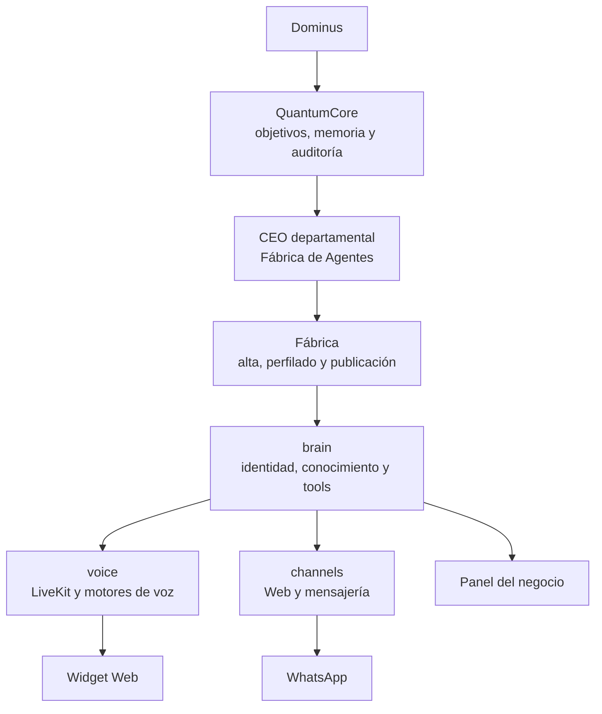

# Fábrica de Agentes — QuantumHive

La Fábrica convierte la información de un negocio en un agente conversacional
multi-tenant: lo entrevista, organiza su conocimiento, le asigna identidad y
voz, permite probarlo y, cuando las integraciones externas están configuradas,
lo publica en Web, voz y canales de mensajería.

Este repositorio contiene el código del producto Fábrica. Incluye el cerebro
compartido, el motor de voz, la API, las interfaces de creación y
administración, el widget embebible, la persistencia en Supabase y el contrato
privado con QuantumCore.

> Si necesitás reutilizar únicamente el motor de voz en otro producto, consultá
> [`SOLO-MOTOR-DE-VOZ-`](https://github.com/CEO-QUANTUMHIVE/SOLO-MOTOR-DE-VOZ-).
> Este repositorio agrega la capa de negocios, tenants, conocimiento, canales y
> operación de agentes.

## Qué resuelve

- Alta guiada de un negocio y creación segura de un agente en estado borrador.
- Investigación opcional de datos públicos mediante el Perfilador de Clientes.
- Identidad, prompt, servicios, conocimiento versionado, herramientas y voz por
  tenant.
- Prueba del agente antes de activarlo.
- Conversación por voz con tres motores comerciales intercambiables.
- Widget Web, panel autenticado y contrato multicanal compartido.
- Contrato e implementación de WhatsApp sobre el mismo cerebro del agente.
- Contrato de coordinación privada con QuantumCore mediante un CEO
  departamental restringido y auditable.

## Cómo encaja en QuantumHive



QuantumCore orquesta y conserva el estado durable de los trabajos. La Fábrica
valida el alcance local y construye u opera agentes. El motor de voz sostiene
la conversación, pero no decide por sí mismo de qué negocio es el visitante ni
qué permisos tiene.

## Arquitectura

```text
src/motor_voz/
  brain/      cerebro reutilizable: prompts, contexto, tenants y tools
  voice/      LiveKit, sesiones y motores de voz
  api/        API HTTP, autenticación, límites y emisión de tokens
  channels/   contrato multicanal, colas, secretos y WhatsApp
  fabrica/    integración backend con el Perfilador de Clientes
  ceo/        contrato privado del departamento para QuantumCore

frontend/
  fabrica/    experiencia guiada para crear y probar agentes
  panel/      operación autenticada de cada negocio
  widget/     agente embebible en una landing
  demo/       comparación local de los tres motores de voz

supabase/migrations/   esquema multi-tenant y migraciones
tests/                 pruebas unitarias, de contrato y smoke tests
```

La frontera más importante es deliberada: `brain/` no importa LiveKit ni
depende de `voice/`. Así, Web, WhatsApp y otros canales reutilizan la misma
inteligencia sin convertirse en bots separados.

### Motores de voz

| Plan | `MOTOR` | Pipeline | Voz |
|---|---|---|---|
| Básico | `pipeline` | Groq STT + Groq LLM + Fish TTS | clonada o de catálogo |
| Medio | `gemini` | Gemini Live | Google |
| Premium | `openai` | OpenAI Realtime | OpenAI |

El motor se puede elegir globalmente con `MOTOR=` o por sesión desde las
interfaces que exponen los niveles comerciales.

## Flujo de creación

1. La Fábrica entrevista al cliente y reúne los datos mínimos del negocio.
2. Si el Perfilador está configurado, investiga únicamente fuentes públicas y
   devuelve información estructurada al backend.
3. Se arma la identidad del agente y su conocimiento versionado.
4. El negocio se guarda como `borrador`: todavía no atiende visitantes.
5. Un operador autorizado lo prueba y lo activa.
6. El tenant activo queda disponible para widget, voz, panel y canales
   conectados.

Un borrador no se vuelve público por accidente: la resolución del tenant filtra
por estado activo. La identidad del negocio se resuelve en el servidor y no se
confía en un `tenant` enviado libremente por el navegador.

## Inicio rápido en Windows

### Requisitos

- Python 3.10 o superior.
- [`uv`](https://docs.astral.sh/uv/).
- Node.js con npm.
- El binario de LiveKit Server en
  `scripts/livekit/livekit-server.exe` para la demo de voz local.
- Credenciales de los servicios que realmente se vayan a probar.

### 1. Preparar el backend

```powershell
Copy-Item .env.example .env
uv sync
```

Completá `.env` sin borrar los valores seguros de ejemplo. Para una
conversación de voz hacen falta LiveKit y las credenciales del motor elegido.
Las funciones multi-tenant requieren Supabase.

### 2. Levantar la demo de voz

```powershell
.\arrancar.ps1
```

El script abre LiveKit, la API, el worker de voz y la demo Web en ventanas
separadas. La primera ejecución puede tardar mientras descarga el modelo de
VAD. Para detener el entorno, cerrá esas ventanas.

### 3. Levantar la Fábrica o el panel

Cada frontend tiene su propio entorno. Nunca pongas claves privadas en
variables `VITE_*`.

```powershell
Copy-Item frontend\fabrica\.env.example frontend\fabrica\.env
Set-Location frontend\fabrica
npm.cmd install
npm.cmd run dev
```

Para el panel, repetí el mismo flujo dentro de `frontend\panel`. Ambos esperan:

- `VITE_API_URL`: URL pública de esta API.
- `VITE_SUPABASE_URL`: URL pública del proyecto Supabase.
- `VITE_SUPABASE_ANON_KEY`: clave pública `anon`, nunca `service_role`.

## Configuración

La plantilla [`.env.example`](.env.example) documenta todas las variables y
permanece sin secretos. Los grupos principales son:

| Integración | Variables principales | Cuándo se necesita |
|---|---|---|
| LiveKit | `LIVEKIT_URL`, `LIVEKIT_API_KEY`, `LIVEKIT_API_SECRET` | voz y widget |
| Supabase | `SUPABASE_URL`, `SUPABASE_SERVICE_ROLE_KEY` | tenants, panel y persistencia |
| Groq + Fish | `GROQ_API_KEY`, `FISH_API_KEY` | plan básico |
| Gemini | `GCP_PROJECT` o `GOOGLE_API_KEY` | plan medio |
| OpenAI | OpenAI directo o variables `AZURE_OPENAI_*` | plan premium |
| QuantumCore | `QUANTUMCORE_TOKEN` | rutas privadas `/v1` |
| Perfilador | `CENTRO_INTELIGENCIA_URL`, `CENTRO_INTELIGENCIA_TOKEN` | investigación pública asistida |
| WhatsApp | variables `META_*`, verificación y almacén privado | onboarding y webhook reales |

Las credenciales de proveedores, el `service_role`, los tokens de WhatsApp y
las muestras de voz clonada no deben entrar en Git ni viajar al navegador.

## Superficies HTTP

La API se inicia con:

```powershell
uv run python -m motor_voz.api.servidor
```

Sus rutas se agrupan por responsabilidad:

- `/api/salud`, `/api/niveles`, `/api/voces` y `/api/token`: voz y widget.
- `/api/fabrica/*`: entrevista, perfilado, alta y activación.
- `/api/panel/*`: tenants, chat, conocimiento y canales autenticados.
- `/webhooks/whatsapp`: recepción y verificación de Meta.
- `/v1/*`: contrato privado del CEO departamental para QuantumCore.

El contrato completo de QuantumCore está en
[`docs/ceo-fabrica-de-agentes.md`](docs/ceo-fabrica-de-agentes.md). Declarar un
worker no significa que esté conectado: si no existe un adaptador inyectado y
auditado, una acción falla cerrada con `worker_no_conectado`.

## Seguridad y aislamiento

- Una sesión válida no alcanza: debe pertenecer al tenant exacto y activo.
- El navegador nunca decide el modo interno ni recibe secretos del backend.
- Los borradores no atienden hasta ser activados explícitamente.
- Los tokens de cada número de WhatsApp viven en un almacén privado; Supabase
  conserva solamente una referencia.
- Las rutas de QuantumCore requieren autenticación máquina a máquina; las
  operaciones con tenant también validan la sesión del actor.
- El CEO departamental no acepta shell libre, código dinámico, `main`, push,
  deploy ni rutas fuera del checkout.
- Este repositorio es público: no se versionan claves ni muestras de voz de
  personas reales.

## Estado de las integraciones

El código del núcleo multi-tenant, los tres motores, el widget, la Fábrica, el
panel, el conocimiento versionado y los contratos de WhatsApp y QuantumCore
vive en este checkout. Algunas capacidades requieren activación externa y no
deben presentarse como conectadas sólo porque el código exista:

En esta documentación, **creado** significa que el código y su contrato existen
en el checkout. No significa automáticamente **funcional de punta a punta**,
**usado por Dominus**, **desplegado** ni **pusheado**; cada uno de esos estados
requiere evidencia independiente.

- El Perfilador necesita su servicio privado desplegado y configurado.
- WhatsApp necesita una app de Meta, webhook público, almacén persistente de
  secretos y autorización real del número.
- Los workers de QuantumCore necesitan adaptadores registrados al iniciar la
  API.
- Las pruebas smoke requieren APIs o una base reales y pueden consumir crédito.

El estado operativo y la evidencia más reciente se mantienen en
[`docs/CONTINUAR-ACA.md`](docs/CONTINUAR-ACA.md) y
[`docs/resultados/`](docs/resultados/).

## Pruebas

Antes de cerrar cualquier cambio:

```powershell
uv run pytest -q
npm.cmd --prefix frontend/fabrica test
npm.cmd --prefix frontend/fabrica run build
npm.cmd --prefix frontend/panel run build
npm.cmd --prefix frontend/widget run build
```

Por defecto, pytest excluye las marcas `smoke` e `integracion`. Ejecutalas sólo
cuando estén autorizados el acceso a servicios reales y su posible costo:

```powershell
uv run pytest -m smoke
uv run pytest -m integracion
```

## Documentación

| Necesitás | Documento |
|---|---|
| Entender el sistema completo | [`docs/MAPA.md`](docs/MAPA.md) |
| Retomar el estado operativo | [`docs/CONTINUAR-ACA.md`](docs/CONTINUAR-ACA.md) |
| Trabajar con QuantumCore | [`docs/ceo-fabrica-de-agentes.md`](docs/ceo-fabrica-de-agentes.md) |
| Escribir la personalidad | [`docs/guia-de-prompts.md`](docs/guia-de-prompts.md) |
| Instalar el widget | [`docs/instalar-el-agente-en-una-landing.md`](docs/instalar-el-agente-en-una-landing.md) |
| Ejecutar una operación conocida | [`docs/procesos/`](docs/procesos/README.md) |

## Regla de trabajo

El grafo de `graphify-out/` se regenera en cada commit. Antes de buscar a mano
en el repositorio, consultalo:

```powershell
graphify query "cómo se resuelve el tenant de un visitante"
graphify explain "Config"
graphify affected "Config"
```

Después del grafo, abrí únicamente los archivos puntuales que señale. Antes de
commitear, verificá la suite y revisá que no se haya agregado ningún secreto,
token o audio sensible.
