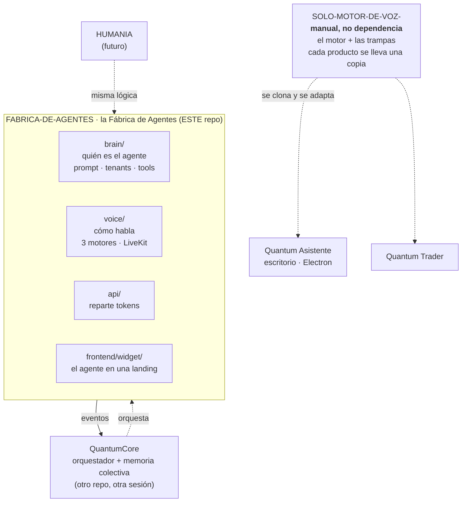
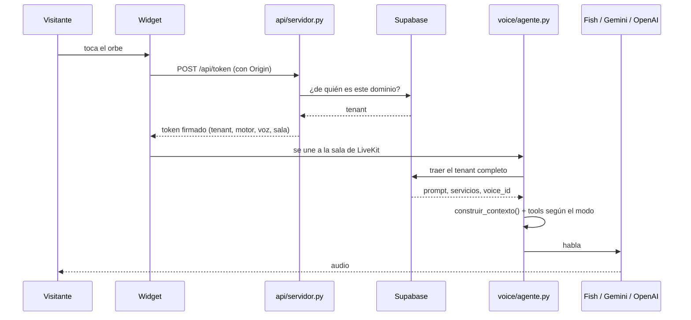
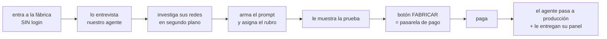

# El mapa: cómo encaja todo

Escrito el 2026-08-12 para que cualquier agente que entre entienda dónde está
parado sin reconstruirlo de cero.

---

## 1. Los tres repos, y qué es cada uno



**Este repo es la Fábrica de Agentes**, no "el motor de voz". Acá viven los
agentes conversacionales de negocio: los de clientes y el nuestro.

**`SOLO-MOTOR-DE-VOZ-` es un manual con código que anda.** No se instala: se
lee, te llevás lo que necesitás y lo adaptás en tu producto. Lo valioso son
las trampas, no el código.

**QuantumCore es el orquestador.** Los scrapers y los agentes de desarrollo van
ahí, no acá. El spec de este repo lo dice en su §1: *"no es un orquestador ni
un reemplazo de Quantum Core"*.

La interfaz privada de esa flecha es el **CEO departamental de Fábrica de Agentes**:
QuantumCore descubre capacidades y entrega trabajos estructurados por `/v1`;
el CEO valida alcance, tenant, worker, cerebro, herramientas y presupuesto
antes de despachar. No acepta comandos libres y no replica las colas ni la
auditoría durable de QuantumCore. Ver
[`ceo-fabrica-de-agentes.md`](ceo-fabrica-de-agentes.md).

---

## 2. Qué producto necesita qué

| Producto | ¿Necesita el motor? | Por qué |
|---|---|---|
| Landing / web | **Sí** | La clave no puede vivir en el navegador, y el audio del navegador (eco, reconexión) lo resuelve LiveKit |
| Escritorio, voz a voz | **No** | Un usuario, la clave está en su máquina. Se conecta directo por WebSocket |
| Escritorio con **voz clonada** | **Sí** | La clonación va por el pipeline de Fish |
| WhatsApp | **Solo `brain/`** | Es texto sobre HTTP. Reusa prompt, tenants y tools sin tocar nada |

**LiveKit es el chasis, no el motor.** Da la sala y el transporte. Lo que
agrega este repo es la calibración —VAD, interrupciones, normalización, qué
modelo en qué región— que es la parte que cuesta horas.

---

## 3. Cómo conviven varios productos en un mismo LiveKit

```
              voz.quantumhive.com.ar   (un solo servidor)
               ↑             ↑              ↑
    worker landing   worker Q. Asistente   worker Dominus
    .env propio      .env propio           .env propio
    SIN agent_name   AGENT_NAME=...        AGENT_NAME=...
```

Un worker **con** `LIVEKIT_AGENT_NAME` solo atiende salas que lo nombran. El de
la landing **no lleva nombre**, y por eso atiende todo lo demás.

**Nunca se comparte un `.env`.** Agregar un producto es un worker nuevo con su
propio archivo, no editar el que ya corre. Ver la regla 0 de `CLAUDE.md`.

---

## 4. El flujo de una conversación, punta a punta



**Lo que decide quién atiende es el dominio**, no lo que mande el navegador. Y
el `modo` (público/interno) decide qué **puede hacer**, no solo qué dice.

---

## 5. Estado real, hoy

| Pieza | Estado |
|---|---|
| Motor de voz, 3 niveles | ✅ en producción |
| 18 muestras de voz pregrabadas | ✅ en producción |
| Cerebro multi-tenant (Fases 5-8) | ✅ en producción, verificado |
| Aislamiento por dominio | ✅ probado en vivo con `curl` |
| Tools y registries (Fase 9) | ✅ código y base, falta oído |
| Widget en la landing | ✅ |
| Repo aislado del motor | ✅ |
| **Autenticación** | 🟡 migración y código listos; falta alta del dueño y prueba E2E real |
| Camino de escritura (`crear_tenant`) | ❌ los tenants nacen de SQL a mano |
| Conversaciones, mensajes e inbox/outbox | ✅ base durable aplicada y aislada |
| Conocimiento versionado | ✅ borrador, publicación y rollback aplicados |
| Sesiones de voz y turnos | ❌ |
| Memoria de los agentes | ❌ depende de lo anterior |
| Límites de gasto / kill-switch (Fase 10) | ❌ |
| La fábrica: pipeline + pantalla | ❌ |
| Contrato multicanal | ✅ Web, WhatsApp, Instagram y Facebook comparten `brain/` |
| Adaptadores WhatsApp / Instagram / Facebook | ❌ faltan conexiones reales |
| Panel de control | 🟡 base PWA + API de entrenamiento listas; falta login E2E y módulos reales de chat/memorias/métricas |
| CEO departamental para QuantumCore | ✅ contrato `/v1`, políticas, aislamiento e idempotencia local; adaptadores de workers se conectan al arranque |

**426 tests en verde** (15 pruebas reales deseleccionadas), más los controles
de integración y los humos contra APIs reales.

---

## 6. El recorrido del cliente, como lo quiere Sergio



**Lo que se crea antes de pagar es un BORRADOR, no un agente vivo.**

Esto ya está resuelto: la migración `0008` permite `borrador` y
`obtener_tenant` **filtra `estado = 'activo'`**, así que un borrador es
inalcanzable por diseño.

Sin esa separación pasan tres cosas: cada entrevista cuesta plata y alguien
puede darle sin parar; si arrancan 100 y pagan 3 quedan 97 agentes muertos; y
el scrapeo apunta a donde le digan.

**El pipeline de la fábrica: un solo agente conversacional, no tres.** De las
tres funciones solo una es una conversación:

| Función | Qué es |
|---|---|
| Entrevistar | Un agente que habla. Este sí |
| Investigar las redes | Un trabajo con navegador. No conversa |
| Armar el prompt | Una llamada al LLM. No conversa |

El agente habla, y cuando junta los datos dispara los otros dos como trabajos
de fondo mientras sigue charlando. Ese es el efecto que Sergio quiere: el
cliente ve al agente entrar a su Instagram mientras conversan.

---

## 7. Lo que falta, en orden de dependencias

**No es orden de ganas: cada uno destraba al siguiente.**

1. **Cerrar autenticación E2E** — alta del dueño y prueba cruzada real.
2. **Camino de escritura** (`crear_tenant`, `guardar_prompt`) — para que el
   pipeline pueda crear el borrador.
3. ✅ **API autenticada del panel (primer bloque)** — conocimiento versionado sin exponer secretos.
4. **Sesiones y turnos** — de acá dependen la memoria, las métricas del modo
   interno y el "entrenar agente".
5. **Memoria** — depende de 4.
6. **Límites de gasto y kill-switch** (Fase 10) — protege la billetera.
7. **La fábrica**: pipeline + pantalla. Depende de 1 y 2.
8. **Adaptador WhatsApp** — sobre sesiones, memoria y outbox comunes.
9. **Instagram y Facebook** — adaptadores separados sobre el mismo contrato.
10. **Redes como ingesta** de la fábrica.
11. ✅ **Base PWA del panel** — responsive, instalable y conectada a entrenamiento.

**WhatsApp es el único independiente**: reusa `brain/` tal cual y se puede
hacer en cualquier momento, incluso en paralelo.

---

## 8. Tres cosas que van a morder si nadie las anota

**Los tokens de las conexiones son el dato más sensible del sistema.** Un token
de WhatsApp de un cliente deja mandar mensajes en su nombre. No van en la misma
tabla que el resto, y ahí hace falta cifrado en reposo, no solo aislamiento por
tenant.

**El §6 del spec está desactualizado.** Dice que el agente receptor puede
`crear_negocio`. La regla de Sergio del 2026-08-11 lo contradice y ya está
implementada al revés. Si alguien lee el spec y lo implementa, reabre el
agujero.

**Un `voice_id` que no existe no da error: da silencio.** El agente contesta,
el LLM factura, y no se escucha nada. Costó horas. Hay un test de humo
(`tests/smoke/test_voces_existen.py`) que lo agarra.

---

## 9. Antes de tocar nada

1. `CLAUDE.md`, **regla 0**: esto está en producción.
2. `docs/procesos/`: los runbooks. Cada uno existe porque eso costó horas.
3. `graphify query "..."`: preguntale al grafo antes de abrir archivos.
4. **Leé el archivo real antes de aplicar un snippet de un plan.** Un plan de
   un día atrás ya nos borró cuatro cosas que funcionaban.
